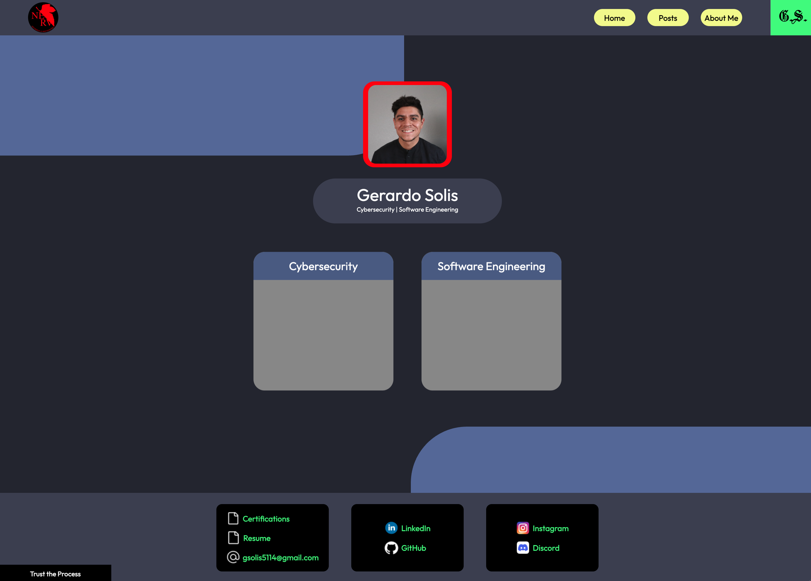

```
  ________                            .__        
 /  _____/  ____   ____   ____   _____|__| ______
/   \  ____/ __ \ /    \_/ __ \ /  ___/  |/  ___/
\    \_\  \  ___/|   |  \  ___/ \___ \|  |\___ \ 
 \______  /\___  >___|  /\___  >____  >__/____  >
        \/     \/     \/     \/     \/        \/ 
```

---

[](https://uptime.betterstack.com/?utm_source=status_badge)

## Overview

- This project involves the development of my personal website https://gsoulis.blog, which is hosted on Cloudflare using
  Cloudflare Workers.

## Tech Stack

- **Frontend**: The UI build tools we used consist of Vite, and React for the frontend.
- **Backend**:The API framework consists of Hono running on the Cloudflare Worker, `/api/posts`.
- **Database**: The Neon Postgres DB via Drizzle ORM, accessed through Cloudflare Hyperdrive.

### Infrastructure

- Cloudflare provides DNS management, reverse proxy, CDN, and DDoS protection.

- The Cloudflare Worker serves the static React application.

### Hosting

- Cloudflare handles the SSL certificates, which are automated, with no setup needed.

- The Cloudflare Worker hosts the static site which is accessible 24/7. This no longer requires automated server
  shutdowns and power-ons as a result.

## Purpose

- The site will feature all projects I have worked on that I have not yet posted or shared, as well as projects I am
  currently working on.

## Contact

- For additional information, please contact me at **jsoulis@pm.me**

- Thank you, and I hope you enjoy your stay :D

## Preview

- Home page preview:



